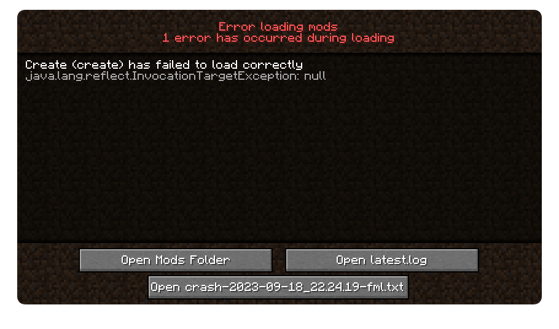

# Como Instalar

> **Atenção:** para essa instalação, é necessário uma conta oficial do Minecraft. Caso você não tenha, fale comigo no Discord e damos um jeito.

1. Baixe o PrismLauncher [aqui](https://prismlauncher.org/download/)
    - Windows: ~~[Instale o Linux](https://garudalinux.org/downloads.html)~~ Baixe o PrismLauncher [aqui](https://prismlauncher.org/download/)
    - Linux: [Instale o PrismLauncher aqui](https://prismlauncher.org/download/linux). Parabéns pelo seu bom gosto em sistemas operacionais.
2. Baixe o `.zip` com o pack [aqui](https://github.com/aMerryElk/mc_modpack_amigos/releases/download/stable/Amigos.zip) ou na lista de Releases ao lado
3. Abra o PrismLauncher e clique em "Add Instance" e em seguida "Import". Selecione o `.zip` baixado e prossiga.
4. Após importar, basta clicar no ícone do pack e ele baixará tudo automaticamente.
5. **(Opcional)** - Selecione quais mods opcionais da lista você deseja instalar e clique Ok.

O pack se manterá atualizado automaticamente toda vez que você iniciar o jogo.

O IP do servidor já está incluído com o pack. Basta mandar uma mensagem no discord com seu username e colocamos você na whitelist.

## Possíveis problemas
- Às vezes, o jogo falha na iniciação com esse erro:

Caso isso aconteça, é só tentar iniciar de novo. Infelizmente não temos como concertar isso no momento, já que depende de um PR em andamento no código de um dos mods.